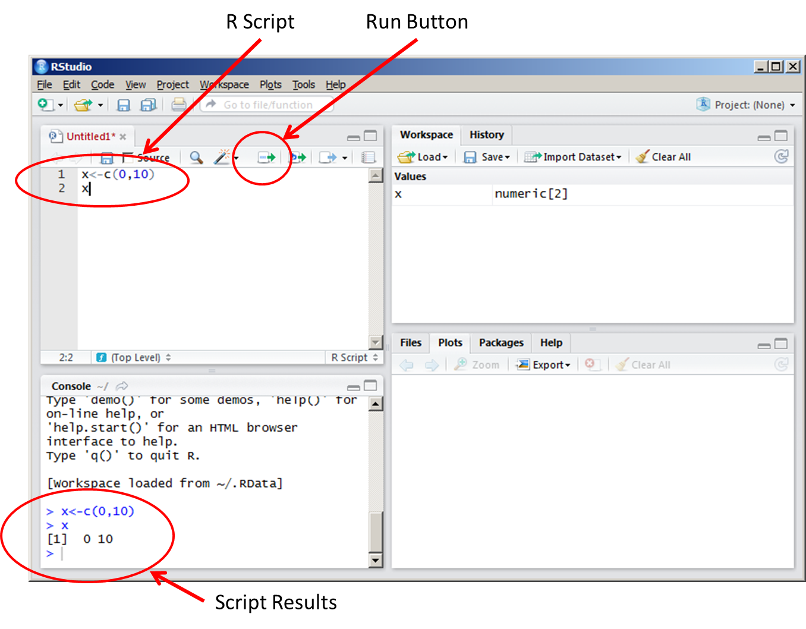
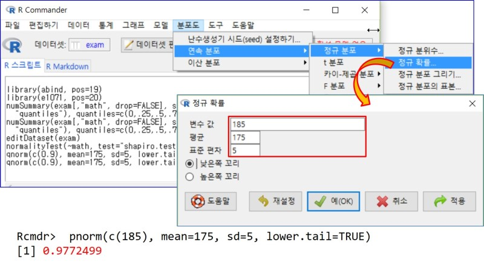

```{r setup, include=FALSE}
library(learnr)
knitr::opts_chunk$set(echo = FALSE)
```

## Outline of the lecture (from 3rd edition)

-   Introduction to the R language (Chapter 2)

-   Programming statistical graphics (Chapter 3)

-   Programming with R (Chapter 4)

-   Programming with `tidyverse` (Chapter 5)

-   Stochastic simulation (Chapter 6)

-   Computational linear algebra (Chapter 7)

-   Numerical optimization (Chapter 8)

## What is statistical programming?

-   **Computer programming** involves controlling computers, telling them what calculations to do, what to display, etc.

-   **Statistical programming** involves doing computations to aid in statistical analysis.

    -   **Data** must be summarized and displayed.
    -   **Models** must be fit to data, and
    -   the **results** displayed.

-   These tasks can be done in a number of different computer applications: Microsoft Excel, SAS, SPSS, R, Stata, Python, Matlab, C++, etc.

-   Statistical programming is closely related to other forms of numerical programming.

    -   Optimization,
    -   Approximation of mathematical functions,
    -   Computational linear algebra (Chapter 7)

-   Computers are very good at exact, reproducible computations, but the real world is full of randomness. In **stochastic simulation**, we program a computer to act as though it is producing random results.

-   Since graphs play an important role in statistical analysis, **drawing graphics** is also important topic of statistical programming.

### Quiz

*Statistical programming languages*

```{r quiz1}
quiz(
  question("Statistical programming tasks can be done in a number of different computer applications including ",
    answer("R", correct = TRUE),
    answer("Microsoft Excel", correct = TRUE),
    answer("Python", correct = TRUE),
    answer("Hancom Office")
  )
)
```

## History of R

-   [R](https://cran.r-project.org) is an open source package for statistical computing.

-   **Open source**: R is freely available, and its users are free to see how it is written, and to improve it.

-   R is based on the computer language S. In 1993 Robert Gentleman and Ross Ihaka at the University of Auckland wanted to experiment with the language, so they developed an implementation, and named it R. ([Article](https://thehistoryofcomputing.net/the-r-programming-language?external_link=true))

-   They made it open source, and thousands of people around the world have contributed to its development.

## Why use a command line?

-   The R system is mainly command-driven, with the user typing in text and asking R to execute it.

```{r echo=FALSE, fig.align='center', out.width = '70%', fig.cap="R studio interface from https://gsp.humboldt.edu/olm/R/01_02_Intro.html."}

```

-   Nowadays most programs use interactive graphical user interfaces (menus, tochscreens, etc.)

```{r echo=FALSE, fig.align='center', out.width = '70%', fig.cap="R commander example from https://m.blog.naver.com/unirone/221600419671."}

```

-   Command-line interfaces require greater knowledge: You need to remember what to type to achieve a particular outcome.

-   Why did we choose such an old-fashioned way of doing things?

    -   Menu-based interfaces have a **limited set** of commands, while a command- line interface is **open ended**.
    -   Learning how to use one command-line interface will give us programming skills and some insight into statistical computations.

```{=html}
<!--
- Why did we choose such an old-fashioned way of doing things?
  + Menu-based interfaces are very convenient when applied to a limited set of commands, from a few to one or two hundred. However, a command- line interface is open ended. 
  + Learning how to use one command-line interface will give you skills that carry over to others, and may even give you some insight into how a menu-driven interface is implemented. 
-->
```
```{=html}
<!--
- There is no question that command-line interfaces require greater knowledge on the part of the user—you need to remember what to type to achieve a particular outcome.
-->
```
-   [RStudio](https://posit.co/download/rstudio-desktop/), which is first released in 2011, is an integrated development environment (IDE), which allows you to edit your program, to search for help, and to run it.

-   In addition, when your first attempt doesn't work, R Studio supports diagnosing and fixing errors.

```{=html}
<!--
- [RStudio](https://posit.co/download/rstudio-desktop/), which is first released in 2011, is an integrated development environment (IDE), which allows you to edit your program, to search for help, and to run it. When your first attempt doesn’t work, they offer support for diagnosing and fixing errors.
-->
```
