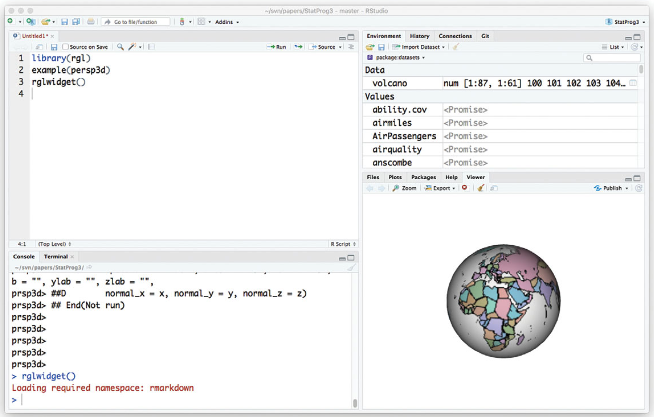
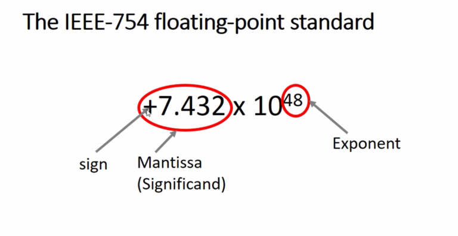

## 2.1 First steps

```{r setup, include=FALSE}
knitr::opts_chunk$set(echo = TRUE, size="tiny")
```

<!--
format: 
  beamer:
    header-includes:
      \RequirePackage{fontspec}
      \RequirePackage{calc}
      \RequirePackage{microtype}
      \RequirePackage{etoolbox}
      \RequirePackage{chngcntr}
      \RequirePackage{scrextend}
      \RequirePackage{contour}
      \RequirePackage[normalem]{ulem}
      \RequirePackage{underscore}
      \RequirePackage{hyperref}
      \titlegraphic{\includegraphics[width=4cm]{images/hanyang.png}}
      \definecolor{hyublue}{HTML}{0E4A84}
      \definecolor{hyulightblue}{HTML}{6e92b5}
      \definecolor{hyusilver}{HTML}{898C8E}
      \definecolor{hyulightsilver}{HTML}{6a737b}
      \setbeamercolor{title}{fg=hyublue}
      \setbeamercolor{frametitle}{bg=hyusilver!25, fg=hyublue}
      \setbeamercolor{background canvas}{bg=White}
      \setbeamercolor{block title}{bg=white, fg=hyublue}
      \setbeamercolor{block body}{bg=white}
      \setbeamercolor{block title example}{bg=hyulightblue, fg=white}
      \setbeamercolor{block body example}{bg=hyulightblue!25}
      \setbeamercolor{progress bar}{fg=hyulightblue}
      \setbeamertemplate{blocks}[rounded][shadow=false]
      \setbeamerfont{title}{size=\fontsize{20}{20}}
      \setbeamerfont{frametitle}{size=\fontsize{14}{20}}
      %\setbeamerfont{title}{family=\fontfamily{montserrat}\selectfont}
      \setlength{\leftmargini}{5pt} % set bullet left margin
      \setlength{\leftmarginii}{5pt}
    navigation: horizontal
    theme: metropolis
    outertheme: metropolis
    fonttheme: metropolis
    colortheme: seahorse
    themeoptions:
      - outer/progressbar=foot
      - outer/numbering=fraction
      - inner/sectionpage=none
    pdf-engine: xelatex
    mainfont: HelveticaNeue
    sansfont: Fira Mono
    monofont: Fira Mono
    monofontoptions: 
      - Scale=1
      - Color=orange
    fontsize: 9pt
    linkcolor: hyublue
    citecolor: hyublue
    filecolor: hyublue
    urlcolor: hyublue
    classoption: ['notheorems']
    CJKmainfont: NanumGothic
    margin-bottom: .4in
    margin-left: .2in
    margin-right: .2in
    colorlinks: true
    papersize: a4
    keep-tex: true
    toc: false
---
-->

```{r echo=FALSE, fig.align='center', out.width = '70%', fig.cap="A typical RStudio display"}

```

- Having opened R or RStudio, you may begin entering and executing commands.
  + Normally, you will use the **Source Pane** to type in your commands, 
  + but you may occasionally use the **Console Pane** directly. The greater-than sign (`>`) is the prompt symbol which appears in the Console Pane.

## 2.1.1 R as a calculator

- Anything that can be computed on the calculator app on your smartphone can be computed at the R prompt.

### Basic operations

- The basic operations are 
  + `+` (add), 
  + `-` (subtract), 
  + `*` (multiply), and 
  + `/` (divide). 
  
- For example, try

```{r division1, eval=F}
5504982/131071

```

- Upon pressing the Enter key (or `CTRL-Enter`, or `CMD-Enter`, depending on your system), the result of the above division operation, `42`, appears in the Console Pane, preceded by the command you executed, and prefixed by the number 1 in square brackets:

```{r division2}
5504982/131071

```

- The `[1]` indicates that this is the first (and in this case only) result from the command.

***

### Multiple commands

- Many commands return multiple values, and each line of results will be labeled to aid the user in deciphering the output. 

```{r seq1}
#the sequence of integers from 17 to 58
17:58

```

The first line starts with the first return value, so is labeled `[1]`; the second line starts with the 23rd, so is labeled `[23]`.

### Parentheses (`(`, `)`)

- Everything that you type after a `#` sign is assumed to be a comment and is ignored by R.

```{r, sumprod1}
5:(2*3 + 10) # the result is the same as 5:16
(7:10) + pi # pi is a stored constant

```

***

- Note that parentheses (`(`, `)`) are used to ensure that the operations (in this caes, `:`, `*`, and `+`) are carried out in the order that we desire.

- In the first case, parentheses were necessary to obtain the result we wanted to see. The following shows what happens when the parentheses are omitted:

```{r, sumprod2}
5:2*3 + 10
#comparison:
5:(2*3) + 10

```

<!--
- If you are surprised by this result, it would be a good exercise to break the calculation down into the three separate operations in order to determine exactly what R is doing.
-->

- The parentheses were not required in `(7:10) + pi`. We used them anyway, for two reasons. 
  + (1) They can help others read and understand the code more quickly. 
  + (2) Although R follows strict and consistent rules regarding order of operations, we believe it is too easy for a user to forget one or more of these rules. Therefore, we recommend using parentheses whenever you are unsure.
  
***

### Other operators

- R can also be used to compute powers with the `^` operator. For example,

```{r power}
3^4

```

- Modular arithmetic is also available. For example, you can compute the remainder after division of 31 by 7, i.e. 31 (mod 7):

```{r mod}
31 %% 7

```

and the integer part of a fraction as

```{r integer}
31 %/% 7

```

- We can confirm that 31 is the sum of its remainder plus seven times the integer part of the fraction:

```{r fraction}
7*4 + 3

```

## 2.1.2 Named storage

- R has a workspace known as the **global environment** that can be used to store the results of calculations, and many other types of objects. 

- Suppose we would like to store the result of the calculation `1.0025ˆ30` for future use. We will assign this value to an object called `interest.30`. To do this, we type

```{r interest30-1}
interest.30 <- 1.0025^30

```

- We tell R to make the **assignment** using an arrow that points to the left, created with the less-than sign (`<`) and the hyphen (`-`). 

- R also supports using the equals sign (`=`) in place of the arrow in most circumstances. But the authors recommend using the arrow, as it makes clear that we are requesting an action (i.e. an assignment), rather than stating a relation (i.e. that `interest.30` is equal to `1.0025^30`), or making a permanent definition.

- Note that when you run this statement, **no output appears**: R has done what we asked, and is waiting for us to ask for something else.

***

- You can see the results of this assignment by **just** typing the name of our new object at the prompt:

```{r interest30-2}
interest.30

```

<!--
- Think of this as just another calculation: R is calculating the result of the expression `interest.30`, and printing it.
-->

- We can also use `interest.30` in further calculations if you wish. For example, you can calculate the bank balance after 30 years at 0.25% annual interest, if you start with an initial balance of $3000:

```{r interest30-3}
initialBalance <- 3000
finalBalance <- initialBalance * interest.30
finalBalance

```

***

### Example 2.1

An individual wishes to take out a loan, today, of $P$ at a monthly interest rate $i$. The loan is to be paid back in $n$ monthly installments of size $R$, beginning one month from now.

**Goal**: calculate $R$.

Equating the present value $P$ to the future (discounted) value of the $n$ monthly payments $R$, we have
$$
P = R(1+i)^{-1} + R(1+i)^{-2} + \cdots + R(1+i)^{-n}
$$
or
$$
P = R\sum_{j=1}^n (1+i)^{-j}.
$$

Summing this geometric series and simplifying, we obtain
$$
P=R\Big( \frac{1 - (1+i)^{-n}}{i} \Big).
$$
This is the formula for the *present value of an annuity*. We can find $R$, given $P$, $n$ and $i$ as
$$
R= P \frac{i}{1-(1+i)^{-n}}.
$$

***

- In R, we define variables as follows: 
  + `principal`: $P$
  + `intRate`: $i$, and 
  + `n`: $n$
  + We will assign the resulting payment value to an object called `payment`.
  
Suppose that the loan amount is $1500, the interest rate is 1% and the number of payments is 10. The resulting code is

```{r ex2-1}
intRate <- 0.01
n <- 10
principal <- 1500
payment <- principal * intRate / (1 - (1 + intRate)^(-n))
payment

```
  
## 2.1.3 Quitting R

- To quit your R session, run

```{r quit1, eval=F}
q()

```
or choose `Quit Seccion...` from the `File` menu.

- You will then be asked whether to save an image of the current workspace, or not, or to cancel. 

<!--
We rarely save the current workspace image, but occasionally find it convenient to do so.
-->

- **Note**: What happens if your omit the parentheses `()` when attempting to quit:

```{r quit2}
q

```

- This has happened because `q` is a **function** that is used to tell R to quit. 
  + Typing `q` by itself tells R to show us the contents of the function `q`.
  + By typing `q()`, we are telling R to call the function `q`. The action of this function is to quit R.

<!--
- **Everything** that R does is done through calls to functions, though sometimes those calls are hidden (as when we click on menus), or very basic (as when we call the multiplication function to multiply 14 times 3).
-->

## 2.2.1 Functions in R

- Most of the work in R is done through **functions**. 

```{r echo=FALSE, fig.align='center', out.width = '70%', fig.cap="A typical function structure in R from https://smac-group.github.io/ds/functions.html."}
knitr::include_graphics("images/functionstructure.png")
```

- For example, we saw that to quit R we can type `q()`. This tells R to call the function named `q`. 

***

- The parentheses surround the **argument list**, which in this case contains nothing: we just want R to quit, and do not need to tell it how.

- We also saw that `q` is defined as

```{r qfct01}
q

```

- This shows that `q` is a function that has three arguments: 
  + `save`, 
  + `status`, and 
  + `runLast`. 
  
- Each of those has a default value: 
  + `"default"`, 
  + `0`, and 
  + `TRUE`, respectively.
  
- What happens when we execute `q()` is that R calls the q function with the arguments set to their default values.

***

- If we want to change the default values, we specify them when we call the function. Arguments are identified in the call (1) by their position, or by (2) specifying the name explicitly. Both

```{r qfct02, eval=F}
q("no") 
q(save = "no")

```
tell R to call `q` with the first argument set to `"no"`, i.e. to quit without saving the workspace. If we had given two arguments without names, they would apply to `save` and `status`. 

- If we want to accept the defaults of the early parameters but change later ones, we give the name when calling the function, e.g.

```{r qfct03, eval=F}
q(runLast = FALSE)

```
or use commas to mark the missing arguments, e.g.

```{r qfct04, eval=F}
q( , , FALSE)

```

***

- Note that we must use `=` to set arguments. 
  + If we had written `q(runLast <- FALSE)` it would be interpreted quite differently from `q(runLast = FALSE)`. 
  + The arrow says to put the value `FALSE` into a variable named `runLast`. 
  + We then pass the result of that action (which is the value `FALSE`) as the first argument of `q()`. 
  + Since save is the first argument, it will act like `q(save = FALSE)`, which is probably not what we wanted.
 
<!--  
- It is a good idea to use named arguments when calling a function which has many arguments or when using uncommon arguments, because it reduces the risk of specifying the wrong argument, and makes your code easier to read.
-->

## 2.2.2 R is case-sensitive

- Consider this:

```{r, error=TRUE}
x <- 1:10
MEAN(x)

```

- Now try

```{r}
MEAN <- mean
MEAN(x)

```

- The function `mean()` is built in to R. R considers `MEAN` to be a different function, because it is case-sensitive: `m` is different from `M`.

## 2.2.3 Listing the objects in the workspace

<!--
- The calculations in the previous sections led to the creation of several simple R objects. These objects are stored in the current R workspace. 
-->

- A list of all objects in the current workspace can be printed to the screen using the `objects()` function:

```{r}
objects()

```

- A synonym for `objects()` is `ls()`. In RStudio the Environment Pane shows both the names and abbreviated displays of the objects' values.

- If we quit our R session without saving the workspace image, then these objects will disappear. 

- If we save the workspace image, then the workspace will be restored at our next R session.

## 2.3.1 Numeric vectors

- A numeric vector is a list of numbers. The `c()` function is used to collect things together into a vector. 

```{r}
c(0, 7, 8)

```

- Again, we can assign this to a named object:

```{r}
x <- c(0, 7, 8) # now x is a 3-element vector

```

- To see the contents of `x`, simply type

```{r}
x

```

***

- The `:` symbol can be used to create **sequences** of increasing (or decreasing) values.

```{r}
numbers5to20 <- 5:20
numbers5to20

```

- Vectors can be joined together (i.e. *concatenated*) with the `c` function.

```{r}
c(numbers5to20, x)

```

- Here is another example of the use of the `c()` function.

```{r}
some.numbers <- c(2, 3, 5, 7, 11, 13, 17, 19, 23, 29, 31, 37, 41,
   43, 47, 59, 67, 71, 73, 79, 83, 89, 97, 103, 107, 109, 113, 119)
some.numbers

```

***

- **Note**: If you type this in the R console (not in the RStudio Source Pane), R will prompt you with a `+` sign for the second line of input. That means the code is **incomplete**:

```{r, eval=F}
#try this
c(numbers5to20, x

```
<!--
RStudio doesn't add the prompt, but it will indent the second line. In both cases you are being told that the first line is **incomplete**: you have an open parenthesis which must be followed by a closing parenthesis in order to complete the command.
-->

- We can append `numbers5to20` to the end of `some.numbers`, and then append the decreasing sequence from 4 to 1:

```{r}
a.mess <- c(some.numbers, numbers5to20, 4:1) 
a.mess

```

<!--
- Remember that the numbers printed in square brackets give the index of the element immediately to the right. Among other things, this helps us to identify the 22nd element of `a.mess` as 89: just count across from the 17th element, 67.
-->

## 2.3.2 Extracting elements from vectors

**Q**. How can we extract the 22nd element of `a.mess`?

- A way to display the 22nd element of `a.mess` is to use square brackets to extract just that element:

```{r}
a.mess[22]

```

- We can extract more than one element at a time.

```{r}
#3, 6, 7 elts of `a.mess`
a.mess[c(3, 6, 7)]

```

- To get the third through seventh element of `numbers5to20`, type

```{r}
numbers5to20[3:7]

```

***

- Negative indices can be used to avoid certain elements. 

```{r}
#select all but the second and tenth elts of `numbers5to20`
numbers5to20[-c(2,10)]

```

- The third through eleventh elements of `numbers5to20` can be avoided as follows:

```{r}
numbers5to20[-(3:11)]

```

- Using a zero index returns nothing. This is not something that one would usually type, but it may be useful in more complicated expressions. For example, recall that `x` contains the vector `(0,7,8)` so that

```{r}
numbers5to20[x]

```

***

- **Note 1**: Do **not** mix positive and negative indices. To see what happens, observe

```{r, error=TRUE}
x[c(-2, 3)]

```

- The problem is that it is not clear what is to be extracted: do we want the third element of x before or after removing the second one?

- **Note 2**: Always be careful to make sure that vector indices are integers. When fractional values are used, they will be truncated towards 0. Thus 0.6 becomes 0, as in

```{r}
x[0.6]

```

- The output `numeric(0)` indicates a numeric vector of length zero.

## 2.3.3 Vector arithmetic

- Arithmetic can be done on R vectors. For example, we can multiply all elements of `x` by 3:

```{r}
x*3

```

- Note that the computation is performed **elementwise**. Addition, subtraction, and division by a constant have the same kind of effect.

```{r}
y <- x - 5
y

```

- For another example, consider taking the 3rd power of the elements of `x`:

```{r}
x^3

```

<!--
- The above examples show how a binary arithmetic operator can be used with vectors and constants.
-->

***

- In general, the binary operators also work element-by-element when applied to pairs of vectors. For example, we can compute $y_i^{x_i}$, for $i=1,2,3,$ i.e. $(y_1^{x_1}, y_2^{x_2}, y_3^{x_3})$, as follows:

```{r}
y^x

```

- When the vectors are different lengths, the shorter one is extended by **recycling**: values are repeated, starting at the beginning. For example, to see the pattern of remainders of the numbers 1 to 10 modulo 2 and 3, 

<!--
we need only give the `2:3` vector once:
-->

```{r}
c(1, 1, 2, 2, 3, 3, 4, 4, 5, 5, 6, 6, 7, 7, 8, 8, 9, 9, 10, 10) %% 2:3

```

- R will give a warning if the length of the longer vector is not a multiple of the length of the smaller one, because that is often a symptom of an error.

<!--
in the code. 
-->

```{r}
c(1, 1, 2, 2, 3, 3, 4, 4, 5, 5, 6, 6, 7, 7, 8, 8, 9, 9, 10, 10) %% 2:4

```

**Q**. Do you see the error? -> **No**.

## 2.3.4 Simple patterned vectors

<!--
We have seen the use of the : operator for producing simple sequences of integers. 
-->
- Patterned vectors can also be produced using the `seq()` function as well as the `rep()` function. For example, the sequence of odd numbers less than or equal to 21 can be obtained using

```{r}
seq(1, 21, by = 2)

```

- Notice the use of `by = 2` here. The `seq()` function has several **optional parameters**, including one named `by`. If `by` is not specified, the default value of 1 will be used.

***

- Repeated patterns are obtained using `rep()`. Consider the following examples:

```{r}
rep(3, 12) # repeat the value 3, 12 times
rep(seq(2, 20, by = 2), 2) # repeat the pattern 2 4 ... 20, twice
rep(c(1, 4), c(3, 2)) # repeat 1, 3 times and 4, twice
rep(c(1, 4), each = 3)  # repeat each value 3 times
rep(1:10, rep(2, 10)) # repeat each value twice

```

## 2.3.5 Vectors with random patterns

- The `sample()` function allows us to simulate things like the results of the repeated tossing of a 6-sided die.

```{r}
sample(1:6, size = 8, replace = TRUE) # an imaginary die is tossed 8 times

```

## 2.3.6 Character vectors

- Scalars and vectors can be made up of strings of characters instead of numbers. All elements of a vector must be of the same type. For example,

```{r}
colors <- c("red", "yellow", "blue")
more.colors <- c(colors, "green", "magenta", "cyan") # this appended some new elements to colors
z <- c("red", "green", 1) # an attempt to mix data types in a vector

```

- To see the contents of `more.colors` and `z`, simply type

```{r}
more.colors
z # 1 has been converted to the character "1"

```

- There are two basic operations you might want to perform on character vectors. To take substrings, use `substr()`. It takes arguments `substr(x, start, stop)`, where 
  + `x` is a vector of character strings, and 
  + `start` and `stop` say which characters to keep. 
  
***

- For example, to print the first two letters of each color use

```{r}
substr(colors, 1, 2)

```

<!--
- The `substring()` function is similar, but with slightly different definitions of the arguments: see the help page `?substring`.
-->

- The other basic operation is building up strings by concatenation within elements. Use the `paste()` function for this. For example,

```{r}
paste(colors, "flowers")

```

***

<!--
We might not want the default space, for example:
-->

- There are two optional parameters to `paste()`. 
  + The `sep` parameter controls what goes between the components being pasted together. 
  + The `paste0()` function is a shorthand way to set `sep = ""`:
  + The collapse parameter to `paste()` allows all the components of the resulting vector to be collapsed into a single string:
  
```{r}
paste("several ", colors, "s", sep = "")
paste0("several ", colors, "s")
paste("I like", colors, collapse = ", ")

```

## 2.3.7 Factors

- Factors offer an alternative way to store character data. A factor with four elements and having the two levels, `control` and `treatment` can be created:

```{r}
grp <- c("control", "treatment", "control", "treatment") 
grp
grp <- factor(grp) 
grp

```

- Factors can be an efficient way of storing character data when there are repeats among the vector elements. This is because the levels of a factor are internally coded as integers. To see what the codes are for our factor, we can type

```{r}
as.integer(grp)

```

***

- The labels for the levels are only stored once each, rather than being repeated. The codes are indices of the vector of levels:

```{r}
levels(grp)
#levels(grp)[as.integer(grp)]

```

- The `levels()` function can be used to change factor labels as well. For example, suppose we wish to change the `"control"` label to `"placebo"`. Since `"control"` is the first level, we change the first element of the `levels(grp)` vector:

```{r}
levels(grp)[1] <- "placebo"

```

- An important use for factors is to list all possible values, even if some are not present. For example,

```{r}
sex <- factor(c("F", "F"), levels = c("F", "M")) 
sex

```
shows that there are two possible values for `sex`, but only one is present.

<!--
 in our vector
-->

## 2.3.8 More on extracting elements from vectors

- As for numeric vectors, square brackets `[]` are used to index factor and character vector elements. For example, the factor `grp` has four elements, so we can print out the third element by typing

```{r}
grp[3]

```

- We can access the second through fifth elements of `more.colors` as follows:

```{r}
more.colors[2:5]

```

## 2.3.9 Matrices and arrays

- To arrange values into a matrix, we use the `matrix()` function:

```{r}
m <- matrix(1:6, nrow = 2, ncol = 3) 
m

```

- We can then access elements using two indices. For example, the value in the first row, second column is

```{r}
m[1, 2]

```

- Somewhat confusingly, R also allows a matrix to be indexed as a vector, using just one value:

```{r}
m[4]

```

***

- Here elements are selected in the order in which they are stored internally: down the first column, then down the second, and so on. This is known as **column-major storage order**.

- Some computer languages use **row-major storage order**, where values are stored in order from left to right across the first row, then left to right across the second, and so on.

- Whole rows or columns of matrices may be selected by leaving one index blank:

```{r}
m[1,]
m[,1]

```

***

- A more general way to store data is in an **array**. Arrays have multiple indices, and are created using the array function:

```{r}
a <- array(1:24, c(3, 4, 2)) 
a
dim(a) #dimensions of a

```

<!--
- When inserting data, the first index varies fastest; when it has run through its full range, the second index changes, etc.
-->


## Floating point numbers

<!--
Computational methods for mumerical analysis in R
-->

- When R creates an integer, R uses the native **32-bit integer** format, which uses (1) 31 bits to store the number and (2) one bit to store the sign of the number. 
  
- Within these limitations, the largest positive number R can hold as an integer is $2^31-1=2147483647$.

```{r}
as.integer(2^31 - 1)
as.integer(2^31) ##too large number for the integer type

```

- Of course, R has no trouble with numbers larger than $2^{31}-1$. However, it will not use the internal integer storage format to hold these numbers. 

```{r}
2^32
class(2^32)

```

***

- **Floating point** numbers provide the way to overcome the limitations of binary integers. 

<!--
- Floating point numbers are capable of storing noninteger values, such as $2.71828182845905$, $3.14159265358979$, and $0.25$. 

- Floating point numbers are also capable of storing much larger numbers, as you can see here:
-->

```{r}
2^40

```

```{r echo=FALSE, fig.align='center', out.width = '70%', fig.cap="The IEEE-754 floating-point standard from https://fastbitlab.com."}

```

- For more information about the floating point numbers system, please refer [this webpage](https://www.geeksforgeeks.org/ieee-standard-754-floating-point-numbers/).

***

- As we have seen, floating point can represent a very broad range of numbers. However, it cannot also represent every number.

- Machine $\epsilon$ is defined as the smallest value such that,
$$
1 + \epsilon > 1,
$$
within the floating point system.

- Intuitively, we know that 1 plus any number greater than 0 will be greater than 1. But with the number spacing within floating point, that is not necessarily the case. Machine $\epsilon$ is the threshold value for representation.

```{r}
.Machine$double.eps
1 + .Machine$double.eps > 1
1 + (.Machine$double.eps/2) > 1

```

***

```{r}
print(.Machine$double.eps, digits=20)
print(.Machine$double.eps/2, digits=20)
print(1 + .Machine$double.eps, digits = 20)
print(1 + .Machine$double.eps / 2, digits = 20)

```

- R provides a second value to measure the precision of the floating point implementation called `.Machine$double.neg.eps.`. This is the smallest value $\epsilon$ such that
$$
1 - \epsilon < 1,
$$
within the floating point system.

```{r}
.Machine$double.neg.eps

```

***

- The most important effect of this is that certain numbers cannot be represented precisely within a floating point system. This is a machine-induced error called **round-off error**.

<!--
This error is the dif- ference between the true value x and the floating point representation.
-->

- Round-off error can be brought to prominence with a simple subtraction exercise (**loss of significance**):

```{r}
20.55 - 19.2 - 1.35
20.55 - 1.35 - 19.2
print(20.55 - 19.2, digits=20)
print(20.55 - 1.35, digits=20)

```
<!--
## 2.4.1 Approximate storage of numbers

- One important distinction in computing is between exact and approximate results.

- It is possible in a computer to represent any rational number exactly, but it is more common to use approximate representations: usually **floating point representations**. These are a binary (base-two) variation on scientific notation.

- For example, we might write a number to four significant digits in scientific notation as $6.926 \times 10^{-4}$. This representation of a number could represent any true value between $0.00069255$ and $0.00069265$.

- Standard floating point representations on computers are similar, except that a power of 2 would be used rather than a power of 10, and the fraction would be written in binary notation. The number above would be written as $1.0112 × 2^{−11}$ if four binary digit precision was used. 

- The subscript 2 in the mantissa $1.011_2$ indicates that this number is shown in base 2; that is, it represents $1\times 2^0 + 0 \times 2^{−1} +1 \times 2^{−2} +1 \times 2^{−3}$, or $1.375$ in decimal notation.

***

- However, $6.926 \times 10^{−4}$ and $1.0112 \times 2^{−11}$ are not identical. Four binary digits give less precision than four decimal digits: a range of values from approximately $0.000641$ to $0.000702$ would all get the same representation to four binary digit precision. 

- In fact, $6.926 \times 10^{−4}$ cannot be represented exactly in binary notation in a finite number of digits. The problem is similar to trying to represent $1/3$ as a decimal: $0.3333$ is a close approximation but is not exact. 

- The standard precision in R is 53 binary digits, which is equivalent to about 15 or 16 decimal digits. To illustrate, consider the fractions $5/4$ and $4/5$. 
  + In decimal notation these can be represented exactly as $1.25$ and 0.8, respectively.
  + In binary notation $5/4$ is $1 + 1/4 = 1.012$. How do we determine the binary representation of $4/5$?

- It is between 0 and 1, so we'd expect something of the form $0.b_1 b_2 b_3\cdots$ where each $b_i$ represents a **bit**, i.e. a 0 or 1 digit. Multiplying by 2 moves all the bits left by one, i.e. $2 \times 4/5 = 1.6 = b_1.b_2b_3\cdots$. Thus $b1 = 1$, and $0.6 = 0.b_2b_3 \cdots$.

- We can now multiply by 2 again to find $2 \times 0.6 = 1.2 = b_2.b_3 \cdots$ , so $b_2 = 1$. Repeating twice more yields $b_3 = b_4 = 0$. (Try it!)

***

- At this point we'll have the number $0.8$ again, so the sequence of 4 bits will repeat indefinitely: in base $2$, $4/5$ is $0.110011001100\cdots$. Since R only stores 53 bits, it won't be able to store $0.8$ exactly. Some rounding error will occur in the storage.

- We can observe the rounding error with the following experiment. With exact arithmetic, $(5/4)\times (4/5) = 1$, so $(5/4)\times (n \times 4/5)$ should be exactly n for any value of $n$. But if we try this calculation in R, we find

```{r}
n <- 1:10
1.25 * (n * 0.8) - n

```
i.e. it is equal for some values, but not equal for $n = 3, 6, \text{ or } 7$. The errors are very small, but non-zero.

- Rounding error tends to accumulate in most calculations, so usually a long series of calculations will result in larger errors than a short one. 

<!--
Some operations are particularly prone to rounding error: for example, subtraction of two nearly equal numbers, or (equivalently) addition of two numbers with nearly the same magnitude but opposite signs. Since the leading bits in the binary expansions of nearly equal numbers will match, they will cancel in subtraction, and the result will depend on what is stored in the later bits.
-->

<!--
***

### Example 2.2

Consider the standard formula for the sample variance of a sample $x_1,\ldots,x_n$:
$$
s^2 = \frac{1}{n-1}\sum_{i=1}^n (x_i - \bar{x})^2,
$$
where $\bar{x}$ is the sample mean, $(1/n) \sum_{i=1}^n x_i$. In R, $s^2$ is available as `var()`, and $\bar{x}$ is `mean()`. For example:

```{r}
x <- 1:11
mean(x)
var(x)
sum((x-mean(x))^2)/10

```

***

Because this formula requires calculation of $\bar{x}$ first and the sum of squared deviations second, it requires that all $x_i$ values be kept in memory. Not too long ago memory was so expensive that it was advantageous to rewrite the formula as
$$
s^2 = \frac{1}{n-1}\Big(\sum_{i=1}^n x_i^2 - n\bar{x}^2 \Big) .
$$

This is called the **one-pass formula,** because we evaluate each $x_i$ value just once, and accumulate the sums of $x_i$ and of $x_i^2$. It gives the correct answer, both mathematically and in our example:

```{r}
( sum(x^2) - 11 * mean(x)^2 ) / 10

```

***

However, notice what happens if we add a large value $A$ to each $x_i$. The sum $\sum_{i=1}^n x_i^2$ increases by approximately $nA^2$, and so does $n\bar{x}^2$. This doesn't change the variance, but it provides the conditions for a **catastrophic loss of precision** when we take the difference:

```{r}
A <- 1.e10
x <- 1:11 + A
var(x)
(sum(x^2) - 11 * mean(x)^2)/10

```

Since R gets the right answer, it clearly doesn't use the one-pass formula, and neither should you.

<!--
## 2.4.2 Exact storage of numbers

- In the previous section we saw that R uses floating point storage for numbers, using a base 2 format that stores 53 bits of accuracy. 

- It turns out that this format can store some fractions exactly: if the fraction can be written as $n/2m$, where $n$ and $m$ are integers (not too large; $m$ can be no bigger than about 1000, but $n$ can be very large), R can store it exactly. The number 5/4 is in this form, but the number 4/5 is not, so only the former is stored exactly.

- Floating point storage is not the only format that R uses. For whole numbers, it can use 32 bit integer storage. In this format, numbers are stored as binary versions of the integers 0 to $2^{32} − 1 = 4294967295$. Numbers that are bigger than $2^{31} − 1 = 2147483647$ are treated as negative values by subtracting $2^{32}$ from them, i.e. to find the stored value for a negative number, add $2^{32}$ to it.

***

### Example 2.3

- The number 11 can be stored as the binary value of 11, i.e. $0 \cdots 01011$, whereas $−11$ can be stored as the binary value of $2^{32} − 11 = 4294967285$, which turns out to be $1 \cdots 10101$. If you add these two numbers together, you get $2^{32}$. Using only 32 bits for storage, this is identical to 0, which is what we’d hope to get for $11 + (−11)$.

- How does R decide which storage format to use? Generally, it does what you (or whoever wrote the function you’re using) tell it to do. If you want integer storage, append the letter `L` to the value: `11` means the floating point value, `11L` means the integer value. Most R functions return floating point values, but a few (e.g. `seq()`, which is used in expressions like `1:10`) return integer values. Generally you don’t need to worry about this: values will be converted as needed.

- What about `64` bit integers? Modern computers can handle 64 bits at a time, but in general, R can’t. The reason is that R expects integer values to be a subset of floating point values. Any 32 bit integer can be stored exactly as a floating point value, but this is not true for all 64 bit integers.
-->

## 2.4.3 Dates and times

<!--
- Dates and times are among the most difficult types of data to work with on computers. The standard calendar is very complicated: months of different lengths, leap years every four years (with exceptions for whole centuries) and so on. 
-->

- The standard calendar is very complicated: months of different lengths, leap years every four years (with exceptions for whole centuries) and so on. 

<!--
- When looking at dates over historical time periods, changes to the calendar (such as the switch from the Julian calendar to the modern Gregorian calendar that occurred in various countries between 1582 and 1923) affect the interpretation of dates.
-->

- Times are also messy, because there is often an unstated time zone (which may change for some dates due to daylight savings time).

<!--
, and some years have “leap seconds” added in order to keep standard clocks consistent with the rotation of the earth.
-->

- There have been several attempts to deal with this in R. 
  + The base package has the function `strptime()` to convert from strings (e.g. `"2020-12-25"`, or `"12/25/20"`) to an internal numerical representation, and `format()` to convert back for printing. 
  + Functions in the [`xts`](https://github.com/joshuaulrich/xts) and [`lubridate`](https://lubridate.tidyverse.org) are also useful.
  
<!--
  + The `ISOdate()` and `ISOdatetime()` functions are used when numerical values for the year, month, day, etc. are known. Other functions are available in the `chron` package.
-->

## 2.4.4 Missing values and other special values

- The missing value symbol is `NA`. Missing values often arise in real data, but they can also arise because of the way calculations are performed.

```{r}
some.evens <- NULL # creates a vector with no elements 
some.evens[seq(2, 20, 2)] <- seq(2, 20, 2)
some.evens

```

- What happened here is that we assigned values to elements $2,4, \cdots ,20$ but never assigned anything to elements $1, 3, \cdots , 19$, so R uses `NA` to signal that the value is unknown. 

- Consider the following:

```{r}
x <- c(0, 1, 2)
x/x

```

***

- The `NaN` symbol denotes a value which is **not a number** which arises as a result of attempting to compute the indeterminate 0/0. This symbol is sometimes used when a calculation does not make sense. In other cases, special values may be shown, or you may get an error or warning message.

```{r}
1/x

```
Here R has tried to evaluate 1/0 and reports the infinite result as `Inf`. 

- When there may be missing values, the `is.na()` function should be used to detect them. For instance,

```{r}
is.na(some.evens)

```

***

The result is a **logical vector**. The `!` symbol means **not,** so we can locate the non-missing values in `some.evens` as follows:

```{r}
!is.na(some.evens)

```

- We can then display the even numbers only:

```{r}
some.evens[!is.na(some.evens)]

```
Here we have used `logical indexing`.
