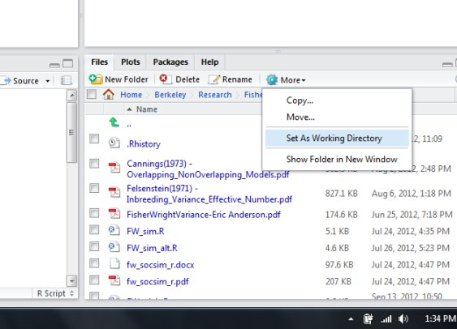

## 2.5 Packages, libraries, and repositories

```{r setup, include=FALSE}
knitr::opts_chunk$set(echo = TRUE, size="tiny")
```

<!--
format: 
  beamer:
    header-includes:
      \RequirePackage{fontspec}
      \RequirePackage{calc}
      \RequirePackage{microtype}
      \RequirePackage{etoolbox}
      \RequirePackage{chngcntr}
      \RequirePackage{scrextend}
      \RequirePackage{contour}
      \RequirePackage[normalem]{ulem}
      \RequirePackage{underscore}
      \RequirePackage{hyperref}
      \titlegraphic{\includegraphics[width=4cm]{images/hanyang.png}}
      \definecolor{hyublue}{HTML}{0E4A84}
      \definecolor{hyulightblue}{HTML}{6e92b5}
      \definecolor{hyusilver}{HTML}{898C8E}
      \definecolor{hyulightsilver}{HTML}{6a737b}
      \setbeamercolor{title}{fg=hyublue}
      \setbeamercolor{frametitle}{bg=hyusilver!25, fg=hyublue}
      \setbeamercolor{background canvas}{bg=White}
      \setbeamercolor{block title}{bg=white, fg=hyublue}
      \setbeamercolor{block body}{bg=white}
      \setbeamercolor{block title example}{bg=hyulightblue, fg=white}
      \setbeamercolor{block body example}{bg=hyulightblue!25}
      \setbeamercolor{progress bar}{fg=hyulightblue}
      \setbeamertemplate{blocks}[rounded][shadow=false]
      \setbeamerfont{title}{size=\fontsize{20}{20}}
      \setbeamerfont{frametitle}{size=\fontsize{14}{20}}
      %\setbeamerfont{title}{family=\fontfamily{montserrat}\selectfont}
      \setlength{\leftmargini}{5pt} % set bullet left margin
      \setlength{\leftmarginii}{5pt}
    navigation: horizontal
    theme: metropolis
    outertheme: metropolis
    fonttheme: metropolis
    colortheme: seahorse
    themeoptions:
      - outer/progressbar=foot
      - outer/numbering=fraction
      - inner/sectionpage=none
    pdf-engine: xelatex
    mainfont: HelveticaNeue
    sansfont: Fira Mono
    monofont: Fira Mono
    monofontoptions: 
      - Scale=1
      - Color=orange
    fontsize: 9pt
    linkcolor: hyublue
    citecolor: hyublue
    filecolor: hyublue
    urlcolor: hyublue
    classoption: ['notheorems']
    CJKmainfont: NanumGothic
    margin-bottom: .4in
    margin-left: .2in
    margin-right: .2in
    colorlinks: true
    papersize: a4
    keep-tex: true
    toc: false
---
-->

- We have already mentioned several *packages*, i.e. `base`, `knitr`, and `chron`. 

- In R, a package is a module containing functions, data, and documentation. 
  + R always contains the base packages (e.g. `base`, `stats`, `graphics`); these contain things that everyone will use. 
  + There are also contributed packages (e.g. `knitr` and `chron`); these are modules written by others to use in R.
  
- When you start your R session, you will have some packages loaded and available for use, while others are stored on your computer in a `library`. To be sure a package is loaded, run code like

```{r}
library(knitr)

```

To see which packages are loaded, run

```{r}
search() # Your list will likely be different from ours.

```

***

- **(WARNING)** A package can only contain one function of any given name, but the same name may be used in another package.

- When you use that function, R will choose it from the first package in the search list. 

- you want to force a function to be chosen from a particular package, prefix the name of the function with the name of the package and `::`, e.g.

```{r, eval=F}
stats::median(x)

```

- If you try to use a package which is not installed on your computer, you will receive an error message:

```{r, error=T}
library(notInstalled)

```

<!--
- This means that the package doesn’t exist on your computer, but it might be available in a *repository* online. 
-->

- The biggest **repository** of R packages is known as [CRAN](https://cran.r-project.orghttps://cran.r-project.org). To install a package from CRAN, you can run a command like

```{r, eval=F}
install.packages("knitr")

```
or, within RStudio, click on the `Packages` tab in the Output Pane, choose `Install`, and enter the name in the resulting dialog box.

<!--
- Because there are so many contributed packages, it is hard to know which one to use to solve your own problems. We suggest reading the CRAN task views at [https://cloud.r-project.org/web/views](https://cloud.r-project.org/web/views).
-->

## 2.6.1 Help pages

<!--
- The online help facility can help you to see what a particular function is supposed to do. There are a number of ways of accessing the help facility.
-->

- If you know the name of the function that you need help with, the `help()` function is likely sufficient. 
  + It may be called with a string or function name as an argument, or
  + you can simply put a question mark (`?`) in front of your query. 
  
- For example, for help on the `q()` function, type

```{r, eval=F}
?q #or
help(q)

```
or just hit the F1 key while pointing at q in RStudio. Any of these will open a help page containing a description of the function for quitting R.

<!--
Another commonly used function in R is `mean()`. 
-->

- `help(mean)` tells us that `mean()` will compute the ordinary arithmetic average.

<!--
or it will do something called “trimming” if we ask for it.
-->

```{r, eval=F}
help(mean)

```

***

- `help.search()` or `??`` are often used, when you don't know the function name.

```{r, eval=F}
??optimization
#or
help.search("optimization")

```

- You may find pages describing functions that you do not have installed, because they are in user-contributed packages. You can usually install them by typing

```{r, eval=F, error=T}
install.packages("packagename")

```

## 2.6.2 Built-in examples

- A useful supplement to `help()` is the `example()` function, which runs examples from the end of the help page:

```{r}
example(mean)

```

- These examples show simple use of the `mean()` function as well as how to use the `trim` argument.

- When `trim = 0.1`, the highest 10% and lowest 10% of the data are deleted before the average is calculated.

<!--
## 2.6.3 Finding help when you don't know the function name

- One way to explore the help system is to use `help.start()`. This brings up an Internet browser, such as Google Chrome or Firefox. The browser will show you a menu of several options, including a listing of installed packages. (The `base` package contains many of the routinely used func- tions; other commonly used functions are in `utils` or `stats`.)
-->

<!--
- Another function that is often used is `help.search()`, abbreviated as a double question mark. For example, to see if there are any functions that do optimization (finding minima or maxima), type
-->


<!--
The name of the R package that is needed is usually listed at the top of the help page.
-->


<!--
This will work as long as the package is available in the CRAN repository.

- Google may also find discussions of similar questions to yours on sites like [https://stackoverflow.com/](https://stackoverflow.com/), where discussions about R are common.

- Another function to note is `RSiteSearch()` which will do a search in the R-help mailing list and other web resources. For example, to bring up information on the treatment of missing values in R, we can type

```{r, eval=F}
RSiteSearch("missing")

```

- The `sos` package gives help similar to `RSiteSearch()`, but organized
differently, and triggered by a triple question mark. For example, try typing

```{r, eval=F}
library(sos) 
???optimization

```

and compare the results to the ones returned by `RSiteSearch()`.
-->

## 2.7.1 Some built-in graphics functions

- Two basic plots are the histogram and the scatterplot. The codes below were used to produce example graphs:

```{r, fig.align="center", fig.width=4.5, fig.height=3}
hist(islands)

```

***

```{r, fig.align="center", fig.width=4.5, fig.height=3.5}
x <- seq(1, 10) 
y <- x^2 - 10 * x 
plot(x, y)

```

Note that the `x` values are plotted along the horizontal axis.

***

- Another useful plotting function is the `curve()` function for plotting the graph of a univariate mathematical function on an interval. <!--
The left and right endpoints of the interval are specified by `from` and `to` arguments, respectively.
A simple example involves plotting the sine function on the interval $[0,6\pi]$:
-->

```{r, fig.align="center", fig.width=4.5, fig.height=3.5}
#plotting a sine function on [0,6pi]
curve(expr = sin, from = 0, to = 6 * pi)

```

***

- Note that the `expr` parameter is either a function (whose output is a numeric vector when the input is a numeric vector) or an expression in terms of `x`. An example of the latter type of usage is:

```{r, fig.align="center", fig.width=4.5, fig.height=3.5}
curve(expr = x^2 - 10 * x, from = 1, to = 10)

```

## 2.7.2 Some elementary built-in functions

### The sample median

- The sample median measures the middle value of a data set. If the ordered data are $x[1] \leq x[2] \leq \ldots \leq x[n]$,
$$
\text{median}(x) = 
\begin{cases}
x[(n + 1)/2], & n \text{ is odd}\\
\{[x[n/2] + x[n/2 + 1]\}/2 & n \text{ is even}
\end{cases}.
$$

<!--
then the median is $x[(n + 1)/2]$ if $n$ is odd, or $\{[x[n/2] + x[n/2 + 1]\}/2$ if $n$ is even.
-->

```{r}
values_1 <- c(10, 10, 18, 30, 32)
median(values_1)
values_2 <- c(40, 10, 10, 18, 30, 32)
median(values_2) #average of 18 and 30

```

***

### Other summary measures

- Summary statistics can be calculated for data stored in vectors. In particular, try

```{r, eval=F}
var(x) # computes the variance of the data in x
summary(x) # computes several summary statistics on the data in x length(x) 
          # number of elements in x
min(x) # minimum value of x
max(x) # maximum value of x
pmin(x, y) # pairwise minima of corresponding elements of x and y pmax(x, y) 
          # pairwise maxima of x and y
range(x) # difference between maximum and minimum of data in x 
IQR(x) # interquartile range: difference between 1st and 3rd
        # quartiles of data in x

```

- For an example of the calculation of pairwise minima of two vectors, consider

```{r}
x <- 1:5 
y <- 7:3 
pmin(x,y)

```

## 2.7.3 Presenting results using R Markdown

<!--
- In most of these, including graphics and results of computations is a chore: for example, you save a graph in R to a file, then import the file into your document. It is also error-prone: you may import the wrong file, change the calculation but forget to import the new graph, or change the text but forget to update the computation, among other errors.
-->

- **R Markdown** is one way to make presenting results easier. 
  + It is a mixture of **Markdown**, a simple way to write a document in a plain text file, and **chunks** of code in R or another computer language. 
  + When you **render** the input into a document, R runs the code, automatically collects printed output and graphics and inserts them into the final document. 

<!--
- We recommend that students produce their assignments and projects in R Markdown as well.
-->

- The simplest way to start is to ask RStudio to produce an initial template; then you delete the sample material, add your own, and render it. Using the menus in RStudio, choose `File|New File|R Markdown`....

- You may choose an HTML document (a web page) or a PDF document.
  + In this template, the first part (between the two `---` lines) is called the **YAML**. It contains information that will be used when rendering your document.
  + The actual document starts after the YAML. Headings are marked with an initial `##`, and text is written out in an essentially normal way.
  + Instructions within the template tell you how to include code chunks that will display results.
  + To do the rendering, click on `Knit` in the top of the pane. This will ask to save the file if you haven’t already done that, then render it and display the result on the screen.
  
<!--
- If we decide we want printed output instead of a web page, we can click on the small downward pointing arrow beside Knit, and choose `Knit to PDF` or `Knit to Word`, and we’d get that format. It’s very easy to use, and we recommend it. We have used a similar system to produce this book.
-->

## 2.8 Logical vectors and relational operators

<!--
- We have used the `c()` function to put numeric vectors together as well as character vectors. R also supports logical vectors. These contain two different elements: `TRUE` and `FALSE`, as well as `NA` for missing.
-->

### 2.8.1 Boolean algebra

- The idea of **Boolean algebra** is to formalize a mathematical approach to logic. Logic deals with statements that are either true or false.

- For example, let $A$ is the statement that the sky is clear, and $B$ is the statement that it is raining. Depending on the weather where you are, 
  + (1) those two statements may both be true (there is a *sunshower*),
  + (2) $A$ may be true and $B$ false (the usual clear day),
  + (3) $A$ false and $B$ true (the usual rainy day), or
  + (4) both may be false (a cloudy but dry day).

| A\linebreak `A` | B\linebreak`B` | not A\linebreak`!A`  | not B\linebreak`!B` | A and B\linebreak`A & B` | A or B\linebreak`A | B` |
|:---:|:---:|:---:|:---:|:---:|:---:|
| `TRUE` | `TRUE` | `FALSE` | `FALSE` | `TRUE` | `TRUE` |
| `TRUE` | `FALSE` | `FALSE` | `TRUE` | `FALSE` | `TRUE` |
| `FALSE` | `TRUE` | `TRUE` | `FALSE` | `FALSE` | `TRUE` |
| `FALSE` | `FALSE` | `TRUE` | `TRUE` | `FALSE` | `FALSE` |

***

### 2.8.2 Logical operations in R

- A logical vector may be constructed as

```{r}
a <- c(TRUE, FALSE, FALSE, TRUE)

```

<!--
The result is a vector of 4 logical values.
-->

- Logical vectors may be used as indices. The elements of `b` corresponding to `TRUE` are selected.

```{r}
b <- c(13, 7, 8, 2) 
b[a]

```

- If we attempt arithmetic on a logical vector, then the operations are performed after converting `FALSE` to `0` and `TRUE` to `1`.

```{r}
sum(a) #we count how many occurrences of TRUE are in the vector.

```

- There are two versions of the Boolean operators. The usual versions are `&`, `|` and `!`, as listed in the previous section. These are all vectorized.
<!--
, so we see for example
-->

```{r}
!a

```

***

- If we attempt logical operations on a numerical vector, 0 is taken to be `FALSE`, and any non-zero value is taken to be `TRUE`:

```{r}
a & (b - 2)

```

- The operators `&&` and `||` are similar to `&` and `|`, but behave differently in two respects.       
  + First, they are not **vectorized**: only one calculation is done, and in newer versions of R, you'll get an error if you try to use them on longer vectors. 
  + Second, they are guaranteed to be evaluated from left to right, with the right-hand operand only evaluated if necessary. 

```{r}
A <- FALSE; B <- TRUE
A && B
A <- FALSE; B <- FALSE

```

- This can save time if evaluating `B` would be very slow, and may make calculations easier, for example if evaluating `B` would cause an error when `A` was `FALSE`.
  

<!--
  For example, if `A` is `FALSE`, then `A && B` will be `FALSE` regardless of the value of `B`, so `B` needn’t be evaluated. This can save time if evaluating `B` would be very slow, and may make calculations easier, for example if evaluating `B` would cause an error when `A` was `FALSE`. This behavior is sometimes called **shortcircuit** evaluation.
-->
  
***

### 2.8.3 Relational operators

- R allows the relational operators: `<`, `>`, `==`, `>=`, `<=`, `!=`.

```{r}
threeM <- c(3, 6, 9)
threeM > 4 # which elements are greater than 4
threeM == 4   # which elements are exactly equal to 4
threeM >= 4   # which elements are greater than or equal to 4
threeM != 4   # which elements are not equal to 4
threeM[threeM > 4] # elements of threeM which are greater than 4
four68 <- c(4, 6, 8)
four68 > threeM # four68 elements exceed corresponding threeM elements
four68[threeM < four68] # print them

```

## 2.9 Data frames, tibbles, and lists

- Data sets frequently consist of more than one column of data, where     + each column represents measurements of a single variable, and 
  + each row usually represents a single observation. 
  
- This format is referred to as **case-by-variable** format.

<!--
- Most data sets are stored in R as data frames or tibbles (Chapter 5). Several data frames come with R. An example is `women` which contains the average heights (in inches) and weights (in pounds) of American women aged 30 to 39:
-->

- Most data sets are stored in R as `data.frame`. An example is `women` which contains the average `height`s (in inches) and `weight`s (in pounds) of American women aged 30 to 39:

```{r}
head(women)

```

***

<!--
- We have displayed the entire data frame, a practice **not** normally recommended, since data frames can be very large, and not much can be learned by scanning columns of numbers. (This is one difference between data frames and tibbles: the latter print in a more compact format.)
-->

- Other ways to view the data are through the use of the `summary()` function as shown below, or by constructing an appropriate graph:

<!--
such as in Figure 2.8, obtained by executing the command
-->

```{r, fig.align="center", fig.width=4, fig.height=2.4}
summary(women)
plot(weight ~ height, data = women)

```

***

- For larger data frames, a quick way of counting the number of rows and columns is important. The functions `nrow()` and `ncol()` play this role:

```{r}
nrow(women)
ncol(women)

```

- We can get both at once using `dim()` (for dimension) and can get summary information using `str()` (for structure):

```{r}
dim(women)
str(women)

```

- In fact, `str()` works with almost any R object, and is often a quick way to find what you are working with.

***

### 2.9.1 Extracting data frame elements and subsets

- We can extract elements from data frames using similar syntax to what was used with matrices.

```{r}
women[7, 2]
#try at home
#women[3, ]; women[4:7, 1]

```

- Data frame columns can also be addressed using their names using the `$` operator. For example, the weight column can be extracted as follows:

```{r}
women$weight

```

- Thus, we can extract all heights for which the weights exceed 140 using

```{r}
women$height[women$weight > 140]

```

- The `with()` function allows us to access columns of a `data.frame` directly without using the `$`. 
<!--
For example, we can divide the weights by the heights in the `women` data frame using
-->

```{r}
with(women, weight/height)

```
<!--
See `help(with)` for more information.
-->

***

### 2.9.2 Taking random samples from populations

- The `sample()` function can be used to take samples (with or without replacement) from larger finite populations.

<!--
- Suppose, for example, that we have a data frame called `fluSurvey` consisting of 15000 entries, and we would like to randomly select 8 entries (without replacement) for detailed study. If the entries have been enumerated (say, by the use of an ID index) from 1 through 15000, we could select the 8 numbers with
-->

- Suppose that we have a data consisting of 15000 entries, and we would like to randomly select 8 entries (without replacement) for detailed study. It can be realized by selecting a random sample of indices:

```{r}
sampleID <- sample(1:15000, size = 8, replace = FALSE) 
sampleID

```

<!--

- The above numbers have been chosen randomly (or at least approximately so), and the random rows of `fluSurvey`, a supposedly existing data frame, can now be extracted with

#```{r}
#fluSample <- fluSurvey[sampleID,]
#
#```
The result is a new data frame consisting of 8 rows and the same number of columns as `fluSurvey`.

-->

***

### 2.9.3 Constructing data frames

- Use the `data.frame()` function to construct data frames from vectors that already exist in your workspace:

```{r}
xy <- data.frame(x, y)
xy

```

- For another example, consider

```{r}
xynew <- data.frame(x, y, new = 10:1)

```

***

### 2.9.4 Data frames can have non-numeric columns

- Columns of data frames can be of different types. For example, the built-in data frame `chickwts` has a numeric column and a factor. Again, the `summary()` function provides a quick peek at this data set.

```{r}
summary(chickwts)

```

- Here, displaying the entire data frame would have been a waste of space, as can be seen from:

```{r}
nrow(chickwts)

```

***

- An important point to be aware of is that in older versions of R (before 4.0.0), the `data.frame()` function automatically converted character vectors to factors. As an example, consider the following data that might be used as a baseline in an obesity study:

```{r}
gender <- c("M", "M", "F", "F", "F") 
weight <- c(73, 68, 52, 69, 64) 
obesityStudy <- data.frame(gender, weight)

```

- The vector `gender` is clearly a character vector, and in R 4.0.0 or later it will be left that way in the data frame:

```{r}
obesityStudy$gender

```

- If you want the older behavior, use the `stringsAsFactors = TRUE` argument when you create the data frame:

```{r}
obesityStudy <- data.frame(gender, weight, stringsAsFactors = TRUE) 
obesityStudy$gender

```

***

- Now, suppose we wish to globally change `F` to `Female` in the data frame. An incorrect approach is

```{r, warning=T, error=T}
wrongWay <- obesityStudy
whereF <- wrongWay$gender == "F"
wrongWay$gender[whereF] <- "Female"
wrongWay$gender

```

- The correct approach is through the levels of the `obesityStudy$gender` factor:

```{r}
levels(obesityStudy$gender)[1] <- "Female" # F is the 1st level -- why? 
obesityStudy$gender # check that F was really replaced by Female

```

***

### 2.9.5 Lists

- Data frames are actually a special kind of **list**, or structure. Lists in R can contain any other objects. 

<!--
- You won’t often construct these yourself, but many functions return complicated results as lists. 
-->

- The `list()` function is one way of organizing multiple pieces of output from functions. For example,

```{r}
x <- c(3, 2, 3)
y <- c(7, 7)
z <- list(x = x, y = y) 
z

```

***

- You can see the names of the objects in a list using the `names()` function, and extract parts of it:

```{r}
names(z) # Print names of objects in list z
z$x # Print the x component of z

```

- There are several functions which make working with lists easy. Two of them are `lapply()` and `vapply()`. The `lapply()` function **applies** another function to every element of a list and returns the results in a new list.

```{r}
lapply(z, mean)

```

***

- Sometimes it might be more convenient to have the results in a vector; the `vapply()` function does that. 
<!--
It takes a third argument to tell R what kind of result to expect from the function. In this case each result of mean should be a number, so we could use
-->

```{r}
vapply(z, mean, 1)

```

<!--
where the `1` just serves as an example of the type of output expected.
-->

- If `mean()` had returned a different kind of result, `vapply()` would have given an error. If we expect more than a single value, the results will be organized into a matrix, e.g.

```{r}
vapply(z, summary, numeric(6))

```

## 2.10 Data input and output

<!--
When in an R session, it is possible to read and write data to files outside of R, for example on your computer's hard drive. Before we can discuss some of the many ways of doing this, it is important to know where the data are coming from or going to.

-->

### 2.10.1 Changing directories

<!--
- It is important to know where the data are coming from or going to.
-->

- In the RStudio Files Pane you can navigate to the directory where you want to work, and choose Set `As Working Directory` from the `More` menu item. 

```{r echo=FALSE, fig.align='center', out.width = '40%', fig.cap="You can use File tab to change the working directory."}

```

- Alternatively you can run the R function `setwd()`. For example, to work with data in the folder mydata on the C: drive, run

```{r, eval=F, error=T}
setwd("c:/mydata") # or setwd("c:\\mydata") #example: for WINDOWS
setwd("~/Desktops/mydata") #example: for MAC OS

```

<!--
After running this command, all data input and output will default to the
mydata folder in the C: drive.

-->

***

### 2.10.2 `dump()` and `source()`

- Suppose you have constructed an R object called `usefuldata`. In order to save this object for a future session, type

```{r, error=T}
dump("usefuldata", "useful.R")

```
This stores the command necessary to create the vector `usefuldata` into the file `useful.R` on your computer’s hard drive. The choice of filename is up to you, as long as it conforms to the usual requirements for filenames on your computer.

- To retrieve the vector in a future session, type

```{r, error=T}
dump(list = objects(), "all.R")

```
This produces a file called `all.R` on your computer’s hard drive. Using `source("all.R")` at a later time will allow you to retrieve all of these objects.

### Example 2.4

To save existing objects `humidity`, `temp` and `rain` to a file called `weather.R` on your hard drive, type

```{r}
dump(c("humidity", "temp", "rain"), "weather.R")

```