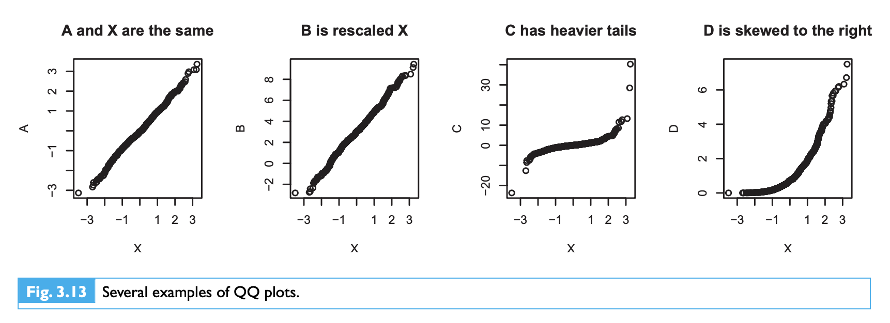
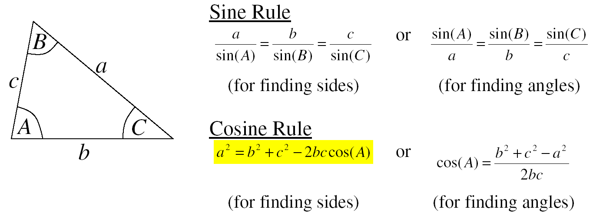
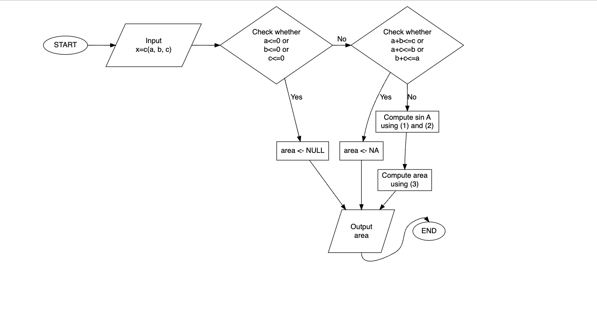

## Instructions


<!--
header-includes:
  \usepackage{amsthm, amsmath, kotex, bm, indentfirst, lmodern, graphicx, hyperref, multicol, footmisc, babel, comment, makeidx, amsfonts, amssymb}
  \usepackage{xeCJK}
        \xeCJKsetup{
          CJKspace=true
        }
  \usepackage{fancyhdr}
  \pagestyle{fancy}
  \setlength\headheight{28pt}
  \fancyhead[RO,LE]{\includegraphics[width=5cm]{images/hanyang.png}}
  \fancyfoot[LE,RO]{}
  \usepackage{color}
  \usepackage{tcolorbox}
  \newtcolorbox{graybox}{
    colback=lightgray,
    colframe=black,
    coltext=black,
    boxsep=5pt,
    arc=4pt}
  \setCJKmainfont[Ligatures=TeX,BoldFont={* ExtraBold},AutoFakeSlant]{NanumMyeongjo}
  \setCJKsansfont[Ligatures=TeX,BoldFont={* ExtraBold},AutoFakeSlant]{NanumGothic}
  \setCJKmonofont{NanumGothicCoding}
output:
  unilur::tutorial_pdf_solution:
    latex_engine: xelatex
linkcolor: Cerulean
citecolor: Fuchsia
urlcolor: RedOrange
toccolor: Black
mainfont: HelveticaNeue
sansfont: HelveticaNeue
monofont: Fira Mono
monofontoptions: 
  - Scale=1
  - Color=orange
CJKmainfont: NanumGothic
classoption: twoside
geometry:
      - left=.2in
      - right=.2in
      - top=.8in
      - bottom=1.2in
---
-->

- Students must use R or R Studio in **full-screen mode**.

- Using Internet browsers is **not** allowed. Only accessing the course website [(https://learning.hanyang.ac.kr)](https://learning.hanyang.ac.kr) for uploading the final answers is allowed.

- To prevent academic dishonesty, students **cannot** leave before the exam ends.

- Late submissions within 10 minutes past the deadline will incur a 5-point deduction, and submissions more than 10 minutes late will receive 0 points.

- We will give you 0 points if over a hundred lines of your code are perfectly identical to other students.

- If you do not follow these rules, we will give you 0 points for this exam.

- In this exam, an F grade will be given if you use ChatGPT, KakaoTalk, etc.

- Students should write (a single) R code about answers of excercises, submit it on course website [(https://learning.hanyang.ac.kr)](https://learning.hanyang.ac.kr).
    + [for 11295 (Fri 10:30~12:00)](https://learning.hanyang.ac.kr/courses/160878)
    + [for 12984 (Fri 13:00~14:30)](https://learning.hanyang.ac.kr/courses/160879)
  
- If you have any questions, please raise your hand. 
  
- Before leaving the classroom, please **check** whether your answers are uploaded well.

- Students **must return** their exam papers after the test is finished.

\vspace{3cm}

Student Number \underline{\hspace{5cm}}

\vspace{3cm}

Name \underline{\hspace{5cm}}

\newpage
<!--
R Numerical Analysis in Science and Engineering
67쪽
## Euler's method
-->

## Problems

**1**. (10pts) Consider radioactive decay, in which the rate of decrease in the number of radioactive atoms $N$ is proportional to the number remaining
$$
\frac{\Delta N}{\Delta t} = \frac{N_{t}-N_{t-1}}{t-(t-1)} =  - k N_{t-1}, \quad{} t=1,2,\ldots, 
$$
Let $N_t$ is the number of radioactive atoms at time $t$. Let initial number at $t=0$, $N_0$, is $100$ and the constant decay rate $k$ is $k=0.03$.

Using `for` loop, compute $N_1, \ldots, N_{100}$. Draw a scatterplot of $(1, N_1) , (2, N_2), \ldots, (100, N_{100})$ with x-axis name `time` and y-axis name `N`.

```{r, solution=TRUE}
# Set up initial conditions and define variables
tmin = 0; tmax = 100; dt = 1
n = (tmax - tmin)/dt + 1 # 101 time values from 0 to 100
time = seq(tmin, tmax, by = dt)
k = .03 # Decay rate constant
N0 = 100 # Initial number of atoms
N = N0 # Initialize N
# Run for loop
for (i in 2:n) {
   dN = -k*N[i-1]*dt
 N[i] = N[i-1] + dN}
# Plot results
plot(time, N, type = "l")


```

\vspace{1cm}
<!--
\newpage


# `islands` data

교재 Exercises 3.1.1
-->

**(2-5)**. Consider the built-in `islands` data in `R`.

**2**. (2pts) Determine the number of observations in this data.

\vspace{0.5cm}

**3**. (2pts) Calculate the mean and median of this data.

\vspace{0.5cm}

**4**. (8pts) Construct a histogram, a normal QQ plot, a boxplot and a dot chart of areas within a single figure using `par(mfrow=c(2,2))`.

\vspace{0.5cm}

**5**. (3pts) Compare the QQ plot result with the plots in Figure 3.13; which one is most similar, and what does this tell you about this data set?

```{r echo=FALSE, fig.align='center', out.width = '60%'}

```

\vspace{1cm}

```{r, solution=TRUE}
# (2)
length(islands)

# (3)
mean(islands)
median(islands)

#(4)
par(mfrow=c(2,2))
hist(islands)
qqnorm(islands)
boxplot(islands)
dotchart(islands)

```

<!--
\newpage


교재 137쪽
R statistical computing 383
-->

**6**. (5pts) Given a starting value of $2$, use a fixed-point iteration method to find a solution (to within 4-digit accuracy) of
$$
x -\text{ln}(x) + \exp(-x) = x
$$

**7**. (5pts) Given a starting value of $2$, use Newton's method to find a zero (to within 4-digit accuracy) of
$$
f(x) = \text{ln}(x) - \exp(-x).
$$

<!--
\vspace{0.5cm}

**7**. (5pts) Given that the root is known to lie between $0.5$ and $2$, use a bisection algorithm find the zero (within 4-digit accuracy) of
$$
f(x) = \text{ln}(x) - \exp(-x).
$$
-->

\vspace{0.5cm}

**8**. (5pts) Let your solution of the problem **7** is $x_{\text{sol}}$. Draw a curve $\text{ln}(x) - \exp(-x)$ with x range is `[0.5, 2.5]` and add a red filled square point to describe $(x_{\text{sol}}, \text{ln}(x_{\text{sol}}) - \exp(-x_{\text{sol}}))$. 

```{r echo=FALSE, fig.align='center', out.width = '90%'}
knitr::include_graphics("images/pch.png")
```

<!--
산점도 그리기: 3점

-->

```{r, solution=TRUE}
#actual solution of x -log(x) + exp(-x) = x is
#x = 1.30979958580415...

#(6) fixed point iterations
#starting value 2, first four digits
x <- 2
count <- 0
while(abs(x - x + log(x) - exp(-x)) > 0.0001){
  x <- x - log(x) + exp(-x)
  count <- count + 1
}
count #3
x #1.309715

#(7) Newton-raphson
x <- 2
f <- log(x) - exp(-x)
tolerance <- 0.0001
while (abs(f) > tolerance){
  f.prime <- 1/x + exp(-x)
  x <- x - f/f.prime
  f <- log(x) - exp(-x)
}
x#1.309709

#(8)
curve(log(x)-exp(-x), xlim=c(0.5,2.5))
points(x, f, pch=15, col="red")

```

\newpage

<!--
이차방정식 해 구하는 함수 if문으로 만들기: 20점
Introduction to scientific programming and simulation using R 63쪽
-->

**9**. (20pts) Write an R function `trianglearea`, which finds the area of a triangle. Your `trianglearea` function **should** match the flowchart in the following picture. Assume that input `x` is always a length-3 `numeric` vector containing `(a,b,c)`, without missing values.

```{r echo=FALSE, fig.align='center', out.width = '80%'}

```

\begin{equation}
\cos A = \frac{b^2+c^2-a^2}{2bc}
\end{equation}

\begin{equation}
\sin A= \sqrt{1-\cos^2 A}
\end{equation}

<!--
\begin{equation}
\sin A= -\sqrt{1-\cos^2 A}
\end{equation}
-->

\begin{equation}
\texttt{area} = \frac{1}{2}b c \sin A
\end{equation}


```{r echo=FALSE, fig.align='center', out.width = '90%'}

```

```{r, solution=TRUE}
trianglearea <- function(x){
  a <- x[1]; b <- x[2]; c <- x[3]
  if(a<=0 | b<=0 | c<=0){
    area <- NULL
  }else{
    if(a+b<=c | a+c<=b | b+c<=a){
      area <- NA
    }else{
      cosA <- (b^2+c^2-a^2)/(2*b*c)
      sinA <- sqrt(1-cosA^2)
      area <- 0.5*b*c*sinA
    }
  }
  return(area)
}
trianglearea(c(-1,2,3))
trianglearea(c(1,2,3))
trianglearea(c(1,2,sqrt(5)))
```